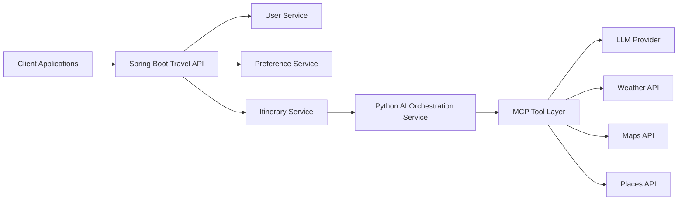

# AI-Travel-Planner Architecture

## High-Level Architecture

# Python AI Service Workflow
1. Retrieve user preferences
2. Select tools
3. Call MCP servers
4. Build context
5. Call LLM
6. Return itinerary

# MCP tools
- get_weather(destination)
- search_attractions(location)
- find_restaurants(preferences)